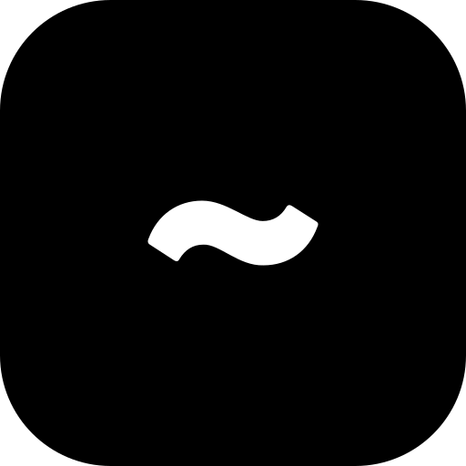

# Tilde Console 1.0
A floating debug console for Godot 4.5+.

- Draggable, resizable, and zoomable interface.
- Extensible API for custom buttons, toggles, and commands.
- Real-time scene inspector and performance monitoring.

<div align = center><br><br>

&ensp;[<kbd> <br> Usage <br> </kbd>](#usage)&ensp;
&ensp;[<kbd> <br> Built-in Commands <br> </kbd>](#built-in-commands)&ensp;
&ensp;[<kbd> <br> Developer API <br> </kbd>](#developer-api)&ensp;
<br><br><br><br></div>

--------------------------------------------------------------------------------

## Requirements
* Godot 4.5+

## Features
* **Multi-Tab Interface**: Terminal, Actions, Inspector, and Settings.
* **Smart Autocomplete**: Context-aware suggestions for commands and arguments.
* **Persistent State**: Window size, position, alpha, and custom aliases are saved to `user://tilde.cfg`.
* **Live Inspector**: Search, browse, and modify the scene tree at runtime (Toggle Visibility, Free Node).
* **Dynamic Actions**: Instantly create UI for debug variables (Sliders, Toggles, Inputs).
* **Watch System**: Track variables in real-time within the Actions tab.
* **Zoomable UI**: Globally scale the console font size with `Ctrl` + `+` / `-`.
* **Performance Monitor**: Draggable overlay for FPS, RAM, VRAM, and draw calls.

--------------------------------------------------------------------------------

## Usage

### Setting Up the Plugin
1. Enable the plugin in **Project Settings -> Plugins**.
2. Make anywhere in the project a file that has "tilde" in it e.g.: `tilde_actions.gd`
3. Yeah that's basically it.

### Basic Controls
* **Toggle Console**: Press the `~` (Tilde) or `` ` `` key.
* **Movement**: Drag the window by the **Title Bar**.
* **Resizing**: Grab any of the edges or corners to resize.
* **Scaling**: Use `Ctrl` + `+` and `Ctrl` + `-` to resize all text globally.
* **Performance Overlay**: Drag the overlay to reposition; click it to cycle text alignment.

--------------------------------------------------------------------------------

## Built-in Commands

| Command | Description |
| :--- | :--- |
| `help` | Lists all registered commands. |
| `clear` | Clears the history log. |
| `quit` | Immediately closes the game. |
| `alias <name> <cmd>` | Create a shortcut (e.g., `alias g god_mode 1`). |
| `alias rm <name>` | Remove an existing alias. |
| `alias list` | Show all custom aliases. |
| `tilde_pause` | Toggle if the game pauses when the console is open. |
| `tilde_perf` | Toggle the performance overlay. |
| `tilde_alpha <val>` | Set window transparency (0.1 - 1.0). |
| `tilde_timescale <v>` | Set `Engine.time_scale` (Slow-mo / Fast-forward). |
| `tilde_reset_config` | Factory reset all Tilde settings and aliases. |

--------------------------------------------------------------------------------

## Developer API

Access the console from any script using the `Tilde` autoload.

### Registering & Modifying Commands
```gdscript
# Simple command
Tilde.register_command("heal", _heal_func, "Heals the player")

# Command with autocomplete suggestions
Tilde.register_command("spawn", _spawn_func, "Spawn item", func(args): 
    return ["health_pack", "ammo"]
)

# Rename an existing command
Tilde.rename_command("quit", "exit")
```

### Logging
```gdscript
# Print a message to the console log
Tilde.log_message("changed this and that", Color.GREEN)
```

### Adding Actions (Actions Tab)
Actions provide a quick UI for common tasks.

```gdscript
Tilde.add_category("Combat")

# Simple Button
Tilde.add_button("Kill All", _kill_logic, "Destroy all enemies", true)

# Persistent Toggle (state saved in config)
Tilde.add_toggle("Invincible", false, _toggle_god, "God Mode", "pref_god")

# Number/Text Input
Tilde.add_input("Gold", _set_gold, "Set player currency")

# Dropdown / Option Selection
Tilde.add_dropdown("Map", func(): return ["Forest", "Cave"], _map_logic, "Teleport")

# Sliders & Colors
Tilde.add_slider("Brightness", 0.0, 2.0, _set_bright, 1.0)
Tilde.add_color("Glow", Color.RED, _set_color)

# Organization
Tilde.add_separator()
Tilde.add_spacer(20)
```

### Real-time Monitoring
```gdscript
# Adds a label to the Actions tab that updates every frame
Tilde.add_watch("Player Speed", func(): return player.velocity.length())
```

### Advanced UI Customization
*   `add_vec2(label, callback, initial)`: Creates a Vector2 input field.
*   `add_custom_control(node, filter_text)`: Inject any Godot Control node into the list.
*   `set_template_override(type, scene)`: Override default UI look (e.g., "Button", "Toggle").

### Keybind Configuration
*   `Tilde.keybind(KEY_F1)`: Adds F1 as an activation key.
*   `Tilde.set_keybinds([KEY_QUOTELEFT, "ui_cancel"])`: Sets multiple keys at once.
*   **In-Game GUI**: Go to the **Tilde** tab -> **Activation Keys** to rebind keys in-game (3 slots).

--------------------------------------------------------------------------------

## License
Boost Software License 1.0.
